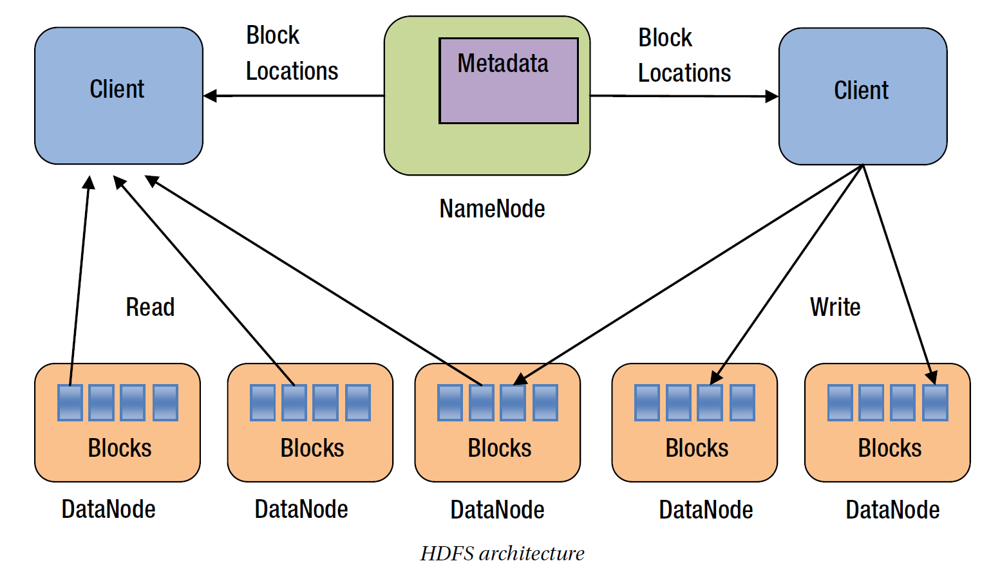
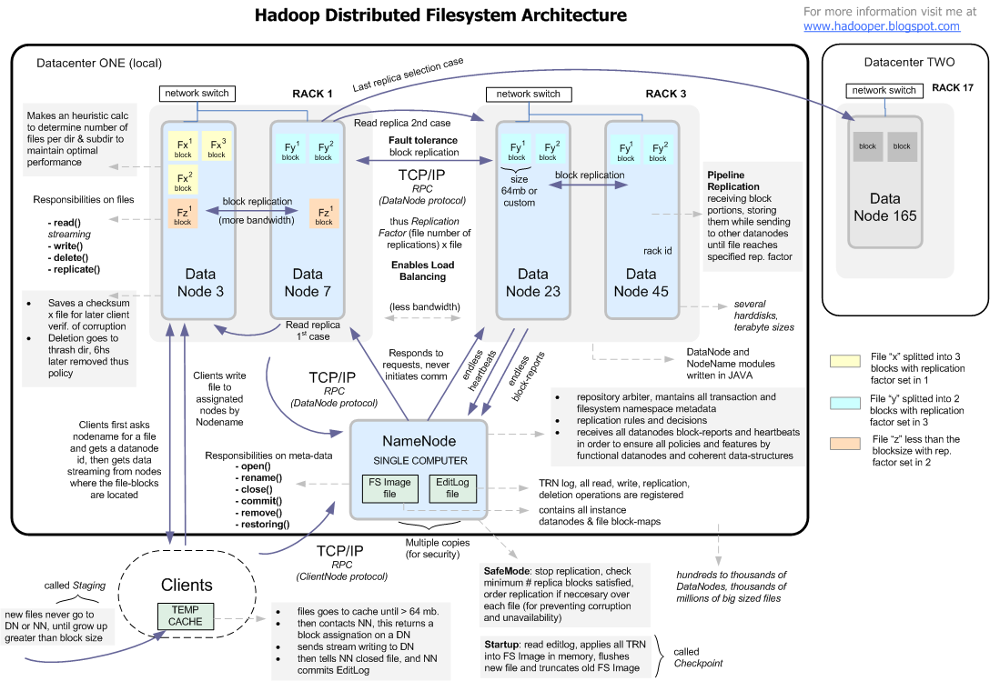
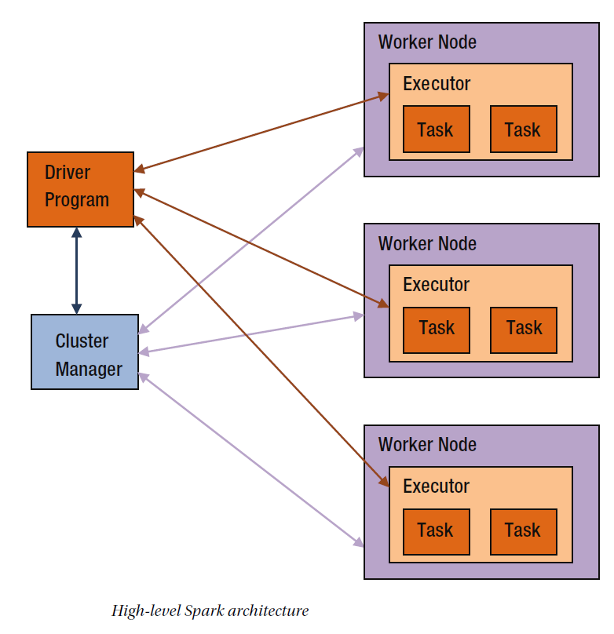

#Hadoop Components
------------------

```

 --------------------------------------------------
| Cluster Manger              | Yarn / Mesos       |
 --------------------------------------------------
| Distributed Computer Engine | Hadoop MR / Spark  |
 --------------------------------------------------
| Distributed File System     | HDFS               |
 --------------------------------------------------

```

##HDFS
------
- HDFS is a distributed file system. It stores a file across a cluster 
of commodity servers. It was designed to store and provide fast access 
to big files and large datasets. It is scalable and fault tolerant.
- Block-structured file system, where files are splited into configurable 
fixed size blocks also known as partitions or splits.
- Default block size id 128MB
- For fault tolerance each block is replicated i.e stored as extra copies, 
with defaulr factor of 3

### **Name Node and Data Node** 
- A NameNode manages the file system namespace. 
- It stores all the metadata for a file. 
- For example, it tracks file names, permissions, and file block locations. 
- To provide fast access to the metadata, a NameNode stores all the metadata 
in memory. 
- A DataNode stores the actual file content in the form of file blocks.
- The NameNode periodically receives two types of messages from the 
DataNodes in an HDFS cluster.
- One is called Heartbeat and the other is called Blockreport. 
- A DataNode sends a heartbeat message to inform the NameNode that it is 
functioning properly. A Blockreport contains a list of all the data blocks on a
DataNode.
- When a client application wants to read a file, it first contacts a 
NameNode. The NameNode responds with the locations of all the blocks 
that comprise that file. A block location identifies the DataNode that 
holds data for that file block. A client then directly sends a read 
request to the DataNodes for each file block. A NameNode is not involved 
in the actual data transfer from a DataNode to a client.
- Similarly, when a client application wants to write data to an HDFS 
file, it first contacts the NameNode and asks it to create a new entry in
the HDFS namespace. The NameNode checks whether a file with the same 
name already exists and whether the client has permissions to create a 
new file. Next, the client application asks the NameNode to choose 
DataNodes for the first block of the file. It creates a pipeline between 
all the replica nodes hosting that block and sends the data block to the 
first DataNode in the pipeline. The first DataNode stores the data block 
locally and forwards it to the second DataNode, which stores it locally 
and forwards it to the third DataNode. After the first file block has 
been stored on all the assigned DataNodes, the client asks the NameNode 
to select the DataNodes to host replicas of the second block. This process 
continues until all the file blocks have been stored on the DataNodes. 
Finally, the client informs the NameNode that the file writing is complete.





#Apache Spark
-------------

Spark is a distributed computing engine and its main abstraction is a resilient distributed dataset (RDD), which can be 
viewed as a distributed collection. Basically, RDD's elements are partitioned across the nodes of the cluster, but Spark 
abstracts this away from the user, letting the user interact with the RDD (collection) as if it were a local one.

Not to get into too many details, but when you run different transformations on a RDD (map, flatMap, filter and others), 
your transformation code (closure) is:

1. Serialized on the driver node,
2. Shipped to the appropriate nodes in the cluster,
3. Deserialized, and 
4. Finally executed on the nodes

You can of course run this locally, but all those phases (apart from shipping over network) still 
occur. [This lets you catch any bugs even before deploying to production]

#Spark Jargons

**Application:-** User program built on Spark. Consists of a driver program and executors on the cluster.

**Application jar:-**  A jar containing the user's Spark application. In some cases users will want to create an "uber jar"
containing their application along with its dependencies. The user's jar should never include Hadoop
or Spark libraries, however, these will be added at runtime.

**Driver Program:-** The process running the main() function of the application and creating the SparkContext or
The program/process responsible for running the Job over the Spark Engine

**Cluster manager:-**  An external service for acquiring resources on the cluster (e.g. standalone manager, Mesos, YARN)

**Deploy mode:-**  Distinguishes where the driver process runs. In "cluster" mode, the framework launches the driver inside
of the cluster. In "client" mode, the submitter launches the driver outside of the cluster.

**Worker Node:-** Any node that can run application code in the cluster

**Executor:-** The process responsible for executing a task or A process launched for an application on a worker node,
that runs tasks and keeps data in memory or disk storage across them. Each application has its own executors.

**Tasks:-** Each stage has some tasks, one task per partition. One task is executed on one partition of data on one executor(machine).

**Job:-**  A piece of code which reads some input  from HDFS or local, performs some computation on the data and writes some
output data or A parallel computation consisting of multiple tasks that gets spawned in response to a Spark action
(e.g. save, collect); you'll see this term used in the driver's logs.

**Stages:-** Jobs are divided into stages. Stages are classified as a Map or reduce stages(Its easier to understand if you
have worked on Hadoop and want to correlate). Stages are divided based on computational boundaries, all
computations(operators) cannot be Updated in a single Stage, especially if there is shuffle operation involved.
It happens over many stages.

**DAG:-** DAG stands for Directed Acyclic Graph, in the present context its a DAG of operators.

**Master:-** The machine on which the Driver program runs

**Slave:-** The machine on which the Executor program runs

**Shuffle:-** A shuffle redistributes data among a cluster of nodes. It is an expensive
operation because it involves moving data across a network. Note that a shuffle does
not randomly redistribute data; it groups data elements into buckets based on some
criteria. Each bucket forms a new partition.

**Job:-** A job is a set of computations that Spark performs to return results to a driver
program. Essentially, it is an execution of a data processing algorithm on a Spark
cluster. An application can launch multiple jobs. Exactly how a job is executed is
covered later in this chapter.

**Stage:-** A stage is a collection of tasks. Spark splits a job into a DAG of stages. A stage
may depend on another stage. For example, a job may be split into two stages, stage
0 and stage 1, where stage 1 cannot begin until stage 0 is completed. Spark groups
tasks into stages using shuffle boundaries. Tasks that do not require a shuffle are
grouped into the same stage. A task that requires its input data to be shuffled begins
a new stage.


##Spark Components
- RDDs - a low level API for expressing DAGs that will be executed in parallel by Spark workers
- Catalyst - an internal library for expressing trees that we use to build relational algebra and expression evaluation.  There's also an optimizer and query planner than turns these into logical concepts into RDD actions.
- Tungsten - an internal optimized execution engine that can compile catalyst expressions into efficient java bytecode that operates directly on serialized binary data.  It also has nice low level data structures / algorithms like hash tables and sorting that operate directly on serialized data.  These are used by the physical nodes that are produced by the query planner (and run inside of RDD operation on workers).
- DataFrames - a user facing API that is similar to SQL/LINQ for constructing dataflows that are backed by catalyst logical plans
- Datasets - a user facing API that is similar to the RDD API for constructing dataflows that are backed by catalyst logical plans


##How an Application Works
 - When a Spark application is run, Spark connects to a cluster manager and acquires
executors on the worker nodes. As mentioned earlier, a Spark application submits a data processing
algorithm as a job. Spark splits a job into a directed acyclic graph (DAG) of stages. It then schedules the
execution of these stages on the executors using a low-level scheduler provided by a cluster manager. The
executors run the tasks submitted by Spark in parallel.
- Every Spark application gets its own set of executors on the worker nodes. This design provides a few
benefits. First, tasks from different applications are isolated from each other since they run in different
JVM processes. A misbehaving task from one application cannot crash another Spark application. Second,
scheduling of tasks becomes easier. Spark has to schedule the tasks belonging to only one application at a time.
It does not have to handle the complexities of scheduling tasks from multiple concurrently running applications.
- However, this design also has one disadvantage. Since applications run in separate JVM processes, they
cannot easily share data. Even though they may be running on the same worker nodes, they cannot share
data without writing it to disk.

##The Spark Programming Model

Dataset (HDFS/local) -> Transformation -> Actions (distributed computation) -> Get results to application running machine

##SparkContext
SparkContext is a class defined in the Spark library. It is the main entry point into the Spark library.

##Resilient Distributed Datasets
- RDD represents a collection of partitioned data elements that can be operated on in parallel. It is the
primary data abstraction mechanism in Spark. It is defined as an abstract class in the Spark library.
Conceptually, RDD is similar to a Scala collection, except that it represents a distributed dataset and it
supports lazy operations.
- An RDD is laid out across the cluster of machines as a collections of partitions, each including a subset of the data.
- Partitions define the unit of parallelism in Spark
- Partitions are processed sequentially in each machine  across the cluster in parallel
 - **Immutable**
An RDD is an immutable data structure. Once created, it cannot be modified in-place. Basically, an
operation that modifies an RDD returns a new RDD.
- **Partitioned**
Data represented by an RDD is split into partitions. These partitions are generally distributed across a cluster
of nodes. However, when Spark is running on a single machine, all the partitions are on that machine.
Note that there is a mapping from RDD partitions to physical partitions of a dataset. RDD provides
an abstraction for data stored in distributed data sources, which generally partition data and distribute it
across a cluster of nodes. For example, HDFS stores data in partitions or blocks, which are distributed across
a cluster of computers. By default, there is one-to-one mapping between an RDD partition and a HDFS
file partition. Other distributed data sources, such as Cassandra, also partition and distribute data across a
cluster of nodes. However, multiple Cassandra partitions are mapped to a single RDD partition.
- **Fault Tolerant** 
RDD is designed to be fault tolerant. An RDD represents data distributed across a cluster of nodes and a
node can fail. As previously discussed, the probability of a node failing is proportional to the number of
nodes in a cluster. The larger a cluster, the higher the probability that some node will fail on any given day.
RDD automatically handles node failures. When a node fails, and partitions stored on that node
become inaccessible, Spark reconstructs the lost RDD partitions on another node. Spark stores lineage
information for each RDD. Using this lineage information, it can recover parts of an RDD or even an entire
RDD in the event of node failures.
- **Interface**
It is important to remember that RDD is an interface for processing data. It is defined as an abstract class
in the Spark library. RDD provides a uniform interface for processing data from a variety of data sources,
such as HDFS, HBase, Cassandra, and others. The same interface can also be used to process data stored in
memory across a cluster of nodes.
Spark provides concrete implementation classes for representing different data sources. Examples
of concrete RDD implementation classes include HadoopRDD, ParallelCollectionRDD, JdbcRDD, and
CassandraRDD. They all support the base RDD interface.
- **Strongly Typed**
The RDD class definition has a type parameter. This allows an RDD to represent data of different types. It is
a distributed collection of homogenous elements, which can be of type Integer, Long, Float, String, or a
custom type defined by an application developer. Thus, an application always works with an RDD of some
type. It can be an RDD of Integer, Long, Float, Double, String, or a custom type.
- **In Memory**
Spark’s in-memory cluster computing capabilities was covered earlier in this chapter. The RDD class
provides the API for enabling in-memory cluster computing. Spark allows RDDs to be cached or persisted in
memory. As mentioned, operations on an RDD cached in memory are orders of magnitude faster than those
operating on a non-cached RDD.

##RDD Transformation and Actions
- Transformation are lazily evaluated, converting the dataset of type U -> dataset of type V.
Examples include map, filter, flatmap, mapPartitions, union etc.,
- Actions triggers the distributed computation to take place on the cluster
- **See examples [here!](rdd/README.md)**


##Serlization - How Spark machines talks with each other in a Cluster
See [this example](serlization/AllAboutSerialization.scala) for more details.

- KyroSerializer (https://github.com/EsotericSoftware/kryo)
..- The KyroSerializer is much faster and generally uses about one tenth of the memory as the default serializer. You can
switch the serializer by setting spark.serializer to spark.KryoSerializer. If you want to use KyroSerializer, you need
to make sure that the classes are serializable by KyroSerializer. Spark provides a trait KryoRegistrator, which you can
extend to register your classes with Kyro, as shown in the following code:

```scala
class Reigstrer extends spark.KyroRegistrator {  
  override def registerClasses(kyro: Kyro) {  
  kyro.register(classOf[MyClass])  
  }  
}
```  

##Caching
- Contetns of RDD after first action can be stored in RAM for fast re-use/computation on iterative algorithms
- If the RDD contents fits the memory it will be stored in RAM, if not it will be recomputed next time an action uses. 
Spark spills partitions that will not fit in the memoey to disk.
- It is beast practise to cache RDD when they are likely to be referenced by multiple actions and are expensive(both money and time) to regenerate.
- `rdd.cahce()` or `rdd.persist(StorageLevel.MEMORY)`
- Differenct StorageLevel
..- MEMORY_SER
..- MEMORY_AND_DISK
..- MEMORY_AND_DISK_SER


#Examples

| Program  | Description       |
|:---------|:-----------------:|
| rdd      | RDD APIs explored |
|Serailization | Class serialization explained |
|BroadCastExample | BroadCase variables |
|GroupBy   | A intro to Spark parallel architecture |
