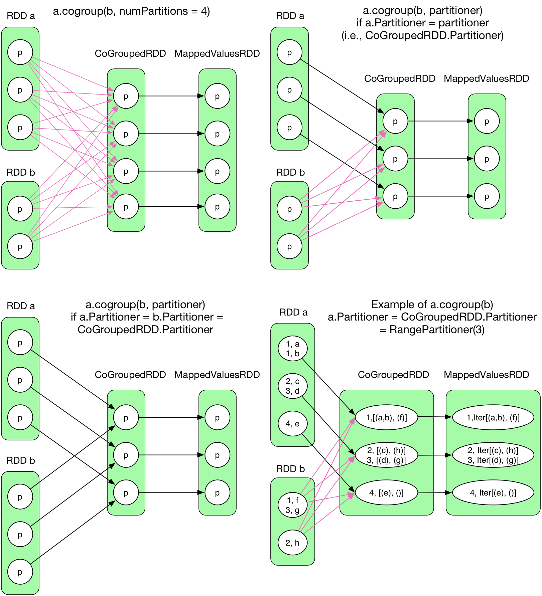

#Contains example usage of RDD APIs

##Trasformations
A transformation method of an RDD creates a new RDD by performing a computation on the source RDD.
This section discusses the commonly used RDD transformations.
RDD transformations are conceptually similar to Scala collection methods. The key difference is that
the Scala collection methods operate on data that can fit in the memory of a single machine, whereas RDD
methods can operate on data distributed across a cluster of nodes. Another important difference is that RDD
transformations are lazy, whereas Scala collection methods are strict. This topic is discussed in more detail
later in this chapter.
- map
- filter
- flatMap
- mapPartitions
- union
- intersection
- subract
- distinct
- cartesian
- zip
- zipWithIndex
- groupBy
- keyBy 
- sortBy 
- pipe
- randomSplit 
- coalesce
- repartition
- sample  
**Transformations on RDD of key-value Pairs**  
In addition to the transformations described in the previous sections, RDDs of key-value pairs support a few
other transformations. The commonly used transformations available for only RDDs of key-value pairs are
briefly described next.    
- keys
- values
- mapValues
- join
- leftOuterJoin
- rightOuterJoin
- fullOuterJoin
- sampleByKey
- subractByKey
- groupByKey
- reduceByKey

##Actions
Actions are RDD methods that return a value to a driver program. This section discusses the commonly used
RDD actions.
- collect
- count
- countByValue
- first
- max
- min
- take
- takeOrdered
- top
- fold
- reduce  
**Actions on RDD of key-value Pairs**  
RDDs of key-value pairs support a few additional actions,
- countByKey
- lookup  
**Actions on RDD of Numeric Types**  
RDDs containing data elements of type Integer, Long, Float, or Double support a few additional actions that
are useful for statistical analysis.
- mean
- stdev
- sum
- variance

##Saving an RDD  
Generally, after data is processed, results are saved on disk. Spark allows an application developer to save
an RDD to any Hadoop-supported storage system. An RDD saved to disk can be used by another Spark or
MapReduce application.  
- saveAsTextFile
- saveAsObjectFile
- saveAsSequenceFile

##RDD Caching Methods   
The RDD class provides two methods to cache an RDD: cache and persist.  
- cache
- persist
- unpersist

##Shared Variables
- Spark uses a shared-nothing architecture. Data is partitioned across a cluster of nodes and each node in
a cluster has its own CPU, memory, and storage resources. There is no global memory space that can be
shared by the tasks. The driver program and job tasks share data through messages.
- In one use case, the driver program shares a large lookup table with the tasks in a job and the job 
involves several stages. By default, Spark automatically sends the driver variables referenced by a task 
to each executor; however, it does this for each stage. Thus, if the lookup table holds 100 MB data and 
the job involves ten stages, Spark will send the same 100 MB data to each worker node ten times.
- Another use case involves the ability to update a global variable in each task running on different nodes.
By default, updates made to a variable by a task are not propagated back to the driver program.

- Boradcast Variable
- Accumulator

#Map-ReducePatterns
-------------------

## [Counter Pattern](counterPattern)
- Count

## [Data Organization](dataOrganization)
- Partitioner
- HashPartitioner

## [Filter Pattern](filterPatterns)
- **Distinct**

- Filter
- Take/Top

## [Iterator Pattern](iteratorPattern)
- Foreach

## [Join Pattern](joinPattern)
- CoalesceRepartition
- **Cogroup**

- **Join**

- LeftOuterJoin
- RightOuterJoin
- Union
- Zip

## [Sorting](sorting)
- Sort

## [Sumarization Pattern](summarizationPatterns)
- Aggregate
- CombineByKey
- **GroupBy/GroupByKey**

- Mean
- **ReduceBy/ReduceByKey**

- Stat
- TreeAggregate
- TreeReduce
..-When we are performing aggregations on data in the cluster, we always have to be
mindful of the fact that the data we are analyzing is stored across multiple machines,
and so our aggregations will require moving data over the network that connects the
machines. Moving data across the network requires a lot of computational resources:
including determining which machines each record will be transferred to, serializing
the data, compressing it, sending it over the wire, decompressing and then serializing
the results, and finally performing computations on the aggregated data. In order to do
this quickly, it is important that we try to minimize the amount of data that we move
around; the more filtering that we can do to the data before performing an aggregation,
the faster we will get an answer to our question.

## Misc and others
- Cartesian
- First
- Fold
- Glom
- Histogram
- Key
- Name/setname
- PersistCache
- Pipe
- Sample
- SaveAs
- SparkContext
- Subract/SubractByKey
- Sum
