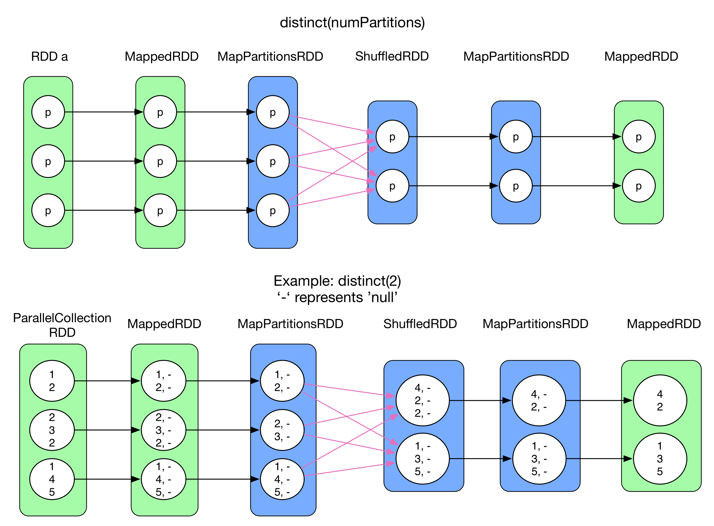
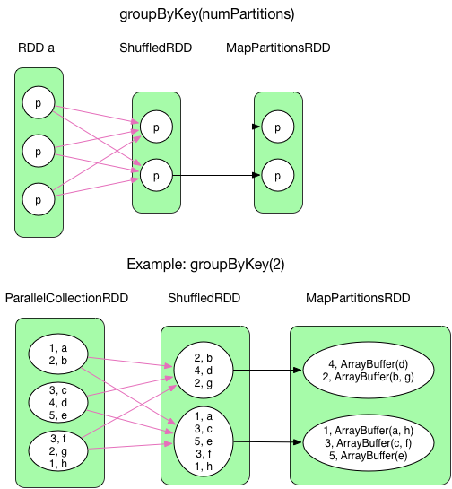
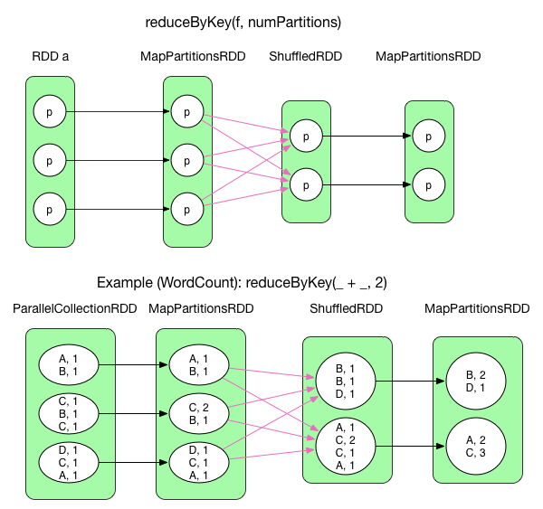

#Contains example usage of RDD APIs

#Map-ReducePatterns
-------------------

## [Counter Pattern](counterPattern)
- Count

## [Data Organization](dataOrganization)
- Partitioner
- HashPartitioner

## [Filter Pattern](filterPattern)
- **Distinct**

- Filter
- Take/Top

## [Iterator Pattern](iteratorPattern)
- Foreach

## [Join Pattern](joinPattern)
- CoalesceRepartition
- **Cogroup**

- **Join**

- LeftOuterJoin
- RightOuterJoin
- Union
- Zip

## [Sorting](sorting)
- Sort

## [Sumarization Pattern](summarizationPatterns)
- Aggregate
- CombineByKey
- **GroupBy/GroupByKey**

- Mean
- **ReduceBy/ReduceByKey**

- Stat
- TreeAggregate
- TreeReduce
..-When we are performing aggregations on data in the cluster, we always have to be
mindful of the fact that the data we are analyzing is stored across multiple machines,
and so our aggregations will require moving data over the network that connects the
machines. Moving data across the network requires a lot of computational resources:
including determining which machines each record will be transferred to, serializing
the data, compressing it, sending it over the wire, decompressing and then serializing
the results, and finally performing computations on the aggregated data. In order to do
this quickly, it is important that we try to minimize the amount of data that we move
around; the more filtering that we can do to the data before performing an aggregation,
the faster we will get an answer to our question.

## Misc and others
- Cartesian
- First
- Fold
- Glom
- Histogram
- Key
- Name/setname
- PersistCache
- Pipe
- Sample
- SaveAs
- SparkContext
- Subract/SubractByKey
- Sum